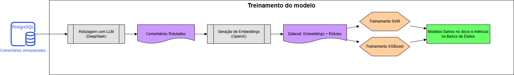
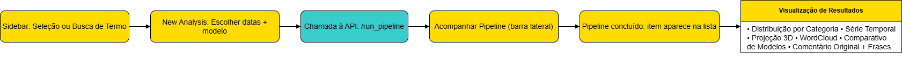
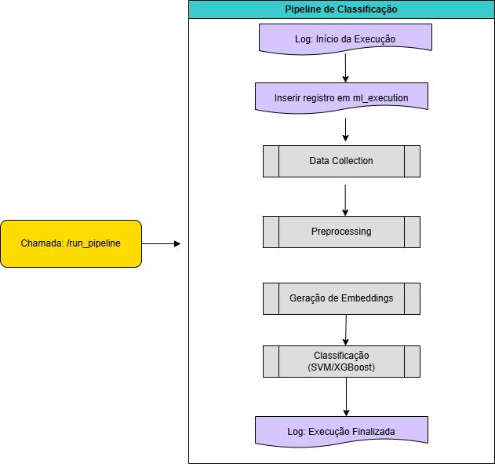

# Análise de Comentários do YouTube com LLM e Machine Learning

## Descrição

Este projeto foi desenvolvido como parte do curso de pós-graduação em **Machine Learning Engineering** da **FIAP**, durante o **Tech Challenge 3**, focado na aplicação prática dos conhecimentos da fase de treinamento de modelos. 

Tendo isto em vista o objetivo do projeto foi projetar e implementar um pipeline completo de coleta, processamento e análise de dados utilizando técnicas de NLP, modelos supervisionados e uma aplicação web para visualização dos resultados.

---

## Tecnologias Utilizadas

- **Python**: Linguagem principal do backend e notebooks.
- **Flask**: Framework para construção da API REST.
- **React**: Framework utilizado no frontend para visualização interativa.
- **OpenAI API**: Geração de embeddings com `text-embedding-3-large`.
- **DeepSeek LLM**: Utilizado para rotulagem automática dos comentários.
- **SVM (Support Vector Machine)**: Modelo supervisionado treinado com os embeddings rotulados.
- **XGBoost**: Modelo supervisionado adicional treinado com os mesmos dados para comparação de desempenho.
- **YouTube Data API v3**: Coleta de vídeos e comentários com base em termos de busca.
- **PostgreSQL**: Banco de dados relacional para armazenar os dados processados.
- **Docker**: Criação de ambiente padronizado (local ou nuvem).
- **AWS EC2**: Hospedagem da aplicação backend e frontend.
- **AWS RDS**: Instância gerenciada do PostgreSQL para armazenamento na nuvem.

---

## Diagrama Geral do Projeto

---

## Visão Geral da Solução

O sistema foi dividido em 3 grandes etapas: **treinamento**, **aplicação web** e **aplicação backend** .

---

### Notebook de treinamento do modelo

- Coleta de comentários a partir de termos definidos.
- Rotulagem automática utilizando LLM (DeepSeek), aproveitando a capacidade do modelo para compreender linguagem natural e sugerir categorias coerentes.
- Geração de embeddings com a API da OpenAI.
- Treinamento de modelos supervisionados (SVM e XGBoost), que embora sejam algoritmos menos robustos quando comparados aos próprios LLMs, foram escolhidos por sua **eficiência e rapidez na inferência**, permitindo uma aplicação mais leve e responsiva.
- Armazenamento dos modelos treinados e suas métricas.
- Os notebooks de treinamento estão localizados na pasta notebooks/, responsáveis por coleta, rotulagem, vetorização e treino dos modelos de ML.

### Aplicação Web

- Usuário define novo termo de busca e intervalo de datas.
- Comentários são coletados e analisados usando modelo treinado.
- Resultados são exibidos por meio de gráficos interativos:
  - Distribuição por categoria
  - Frequencia de categorias
  - Série temporal
  - Projeção 3D dos embeddings
  - Comparação entre modelos
  - A aplicação web está disponível na pasta web_app/.

  

## Backend e APIs

- Expor endpoint para **iniciar o pipeline** de análise (`/run_pipeline`)
- Gerenciar **status de execução**, execuções anteriores e exclusão de análises
- Disponibilizar dados para visualização:
  - Embeddings e rótulos por execução
  - Contagem por categoria (SVM)
  - Word cloud por rótulo
  - Frases agrupadas por comentário original
  - Série temporal de comentários por categoria
  - Métricas e versões dos modelos treinados
  - O backend da aplicação está localizado na pasta `backend/` e é responsável por toda a lógica de orquestração do pipeline e exposição das APIs REST utilizadas pelo frontend.
 
  
  
  ---

## Resultados Obtidos

O sistema foi publicado em ambiente na AWS (EC2 + RDS) para a correção e permite explorar os comentários de vídeos públicos com base em modelos treinados. As análises produzidas demonstram como é possível usar LLMs de forma estratégica para **rotulagem automática** e, em seguida, treinar **modelos mais leves e eficientes** que possam ser usados em produção com rapidez.

As principais entregas do projeto incluem:

- Um pipeline funcional de coleta, processamento, vetorização e treinamento.
- Uma interface web simples, mas interativa, para novas análises.
- Modelos supervisionados capazes de classificar comentários automaticamente com base em rótulos pré-definidos, reduzindo custos e tempo de resposta em relação ao uso direto de LLMs na inferência.

---
