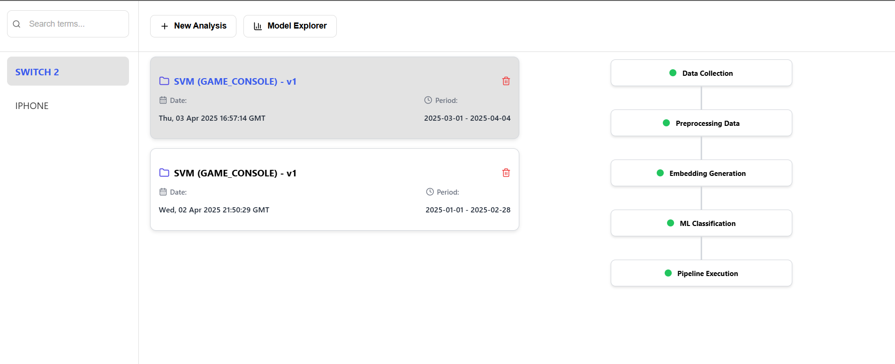
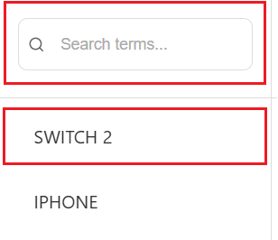
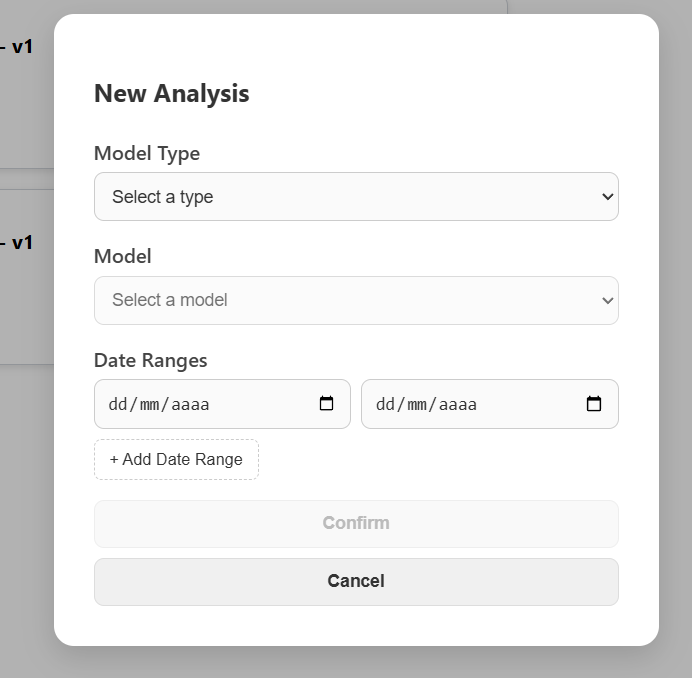
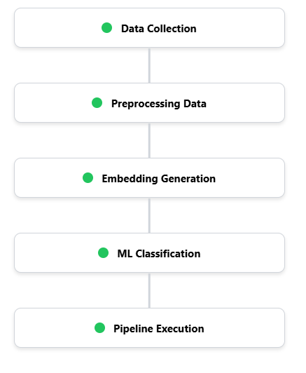
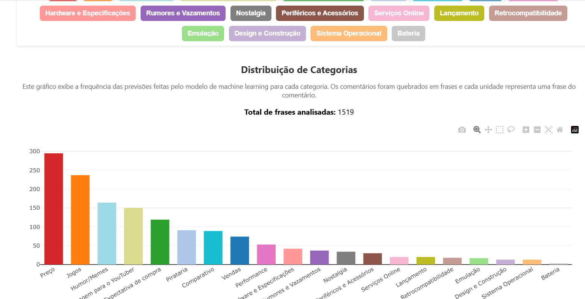
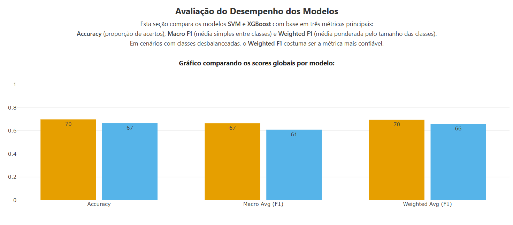

# Frontend - Análise de Comentários do YouTube

Este frontend foi desenvolvido em React e faz parte do projeto de Análise de Comentários do YouTube com LLM e Machine Learning, integrando com a API Flask disponível no backend.

---

## Interface da Aplicação

> Abaixo estão prints das principais etapas da aplicação, como seleção de termo, execução do pipeline e visualização de resultados.

  

---

## Funcionalidades Principais

- Campo de busca para termos no YouTube.
- Seleção de modelo treinado (SVM ou XGBoost).
- Escolha de intervalo de datas para análise.
- Visualização de resultados com gráficos interativos:
  - Distribuição por categoria
  - Série temporal de comentários
  - Projeção 3D dos embeddings
  - Análise por comentário original
  - Comparativo entre modelos

---

## Fluxo de Uso da Aplicação

### 1. Seleção de Termo

Na **Sidebar**, o usuário pode selecionar um termo previamente analisado ou pesquisar um novo termo pelo campo de busca. A seleção ativa libera os botões principais da aplicação.

  

---

### 2. Nova Análise com o Botão "New Analysis"

Ao clicar no botão **New Analysis**, o usuário define um ou mais intervalos de datas e escolhe qual modelo treinado será utilizado. Essa ação inicia o pipeline completo (coleta, rotulagem, embeddings, classificação).

  

---

### 3. Acompanhamento do Pipeline

Durante a execução, é possível acompanhar o progresso de cada etapa na lateral direita da tela. O pipeline é assíncrono e mostra o status de cada estágio.

  

---

### 4. Visualização das Análises Concluídas

Após a conclusão do pipeline, a nova análise aparece na lista. Clicando no item, o sistema exibe todos os gráficos e resultados de forma interativa.

  

---

### 5. Exploração de Modelos com "Model Explorer"

O botão **Model Explorer** leva o usuário a uma área específica para visualizar os modelos treinados, suas versões, tipos e métricas comparativas de desempenho.

  

---